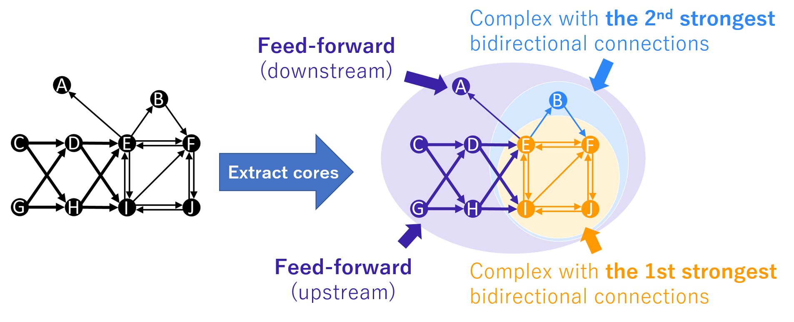

# Bidirectionally connected cores
This toolbox contains MATLAB codes of the method for extracting bidirectionally connected cores from a network ([Kitazono et al., 2023](#Citation)).

The toolbox provides MATLAB codes that enable extracting network cores in which elements are strongly bidirectionally connected. We call the network cores “complexes”. This name and concept originate from integrated information theory of consciousness, although the specific definitions of complexes differ (Balduzzi & Tononi, 2008, PLoS CB; Oizumi et al., 2014, PLoS CB). The toolbox also provides tools for visualizing extracted complexes. 

To illustrate how the proposed method works, let us consider a network shown on the left in the Figure bellow as an example. The network consists of 10 nodes, A-J. The nodes BEFIJ are bidirectionally connected, while the nodes ACDGH are feed-forwardly connected. By using the method, we can extract network cores "complexes" from this network, which are shown by color shading. The subnetwork EFIJ (orange) is the complex with the strongest bidirectional connections. The subnetwork BEFIJ (light blue) is the complex with the 2nd strongest bidirectional connections. Thus, by using the proposed method, we can hierarchically decompose a network into complexes with bidirectional connections of different strengths. For more details, please read [Kitazono et al., 2023](#Citation). 

You can freely use this toolbox at your own risk. Comments, bug reports, and proposed improvements are always welcome.

### Citation
If you use this toolbox, please read and cite the following paper:  
- [J. Kitazono, Y. Aoki, M. Oizumi. (2023). Bidirectionally connected cores in a mouse connectome: Towards extracting the brain subnetworks essential for consciousness. *Cerebral Cortex*.](https://academic.oup.com/cercor/article-lookup/doi/10.1093/cercor/bhac143)

## Getting Started
Add path to the toolbox: 
`addpath(genpath('THE_FOLDER_WHERE_THE_TOOLBOX_IS/BidirectionallyConnectedCores'))` 
and then, you can use the method easily: 
`[complexes, w_mc_complexes, main_complexes, w_mc_main_complexes, Res] = HPC( W );` 
where _W_ is a connection matrix. 

For more details on how to use the toolbox, please look at the codes in the "demos" folder containing codes for reproducing main figures in [Kitazono et al., 2023](#Citation).

### Trouble shooting
- *Invalid MEX File Errors*. In the case you get "Invalid MEX-file" error messages, you need to compile cpp files using the command “mex”. Please follow the procedure in the PDF “Setup Guide”.

## Dependencies
This toolbox uses
- a C++ library [LEMON](https://lemon.cs.elte.hu/trac/lemon), which is used for searching for min-cuts.
- [Violin plots for matlab](https://github.com/bastibe/Violinplot-Matlab), which is used for visualizing results.
